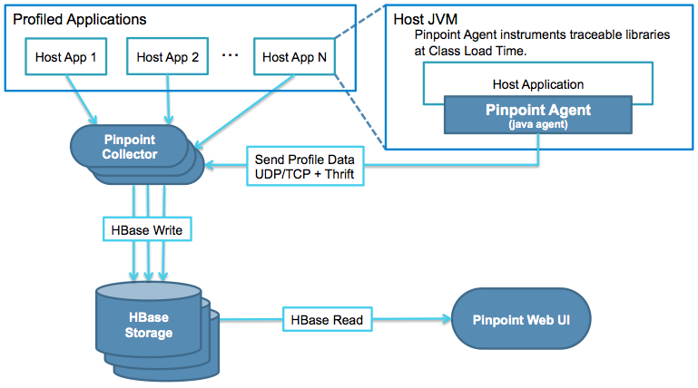

## 简介

Pinpoint是一个开源的 APM (Application Performance Management/应用性能管理)工具，用于基于java的大规模分布式系统。



## 环境说明

- centos 7.5

- java8

- 上传所需文件(百度网盘:10-Development/software/pinpoint)：

  

- 安装路径`/opt`

## 安装hbase

### 解压

```bash
tar -zxvf hbase-1.2.7-bin.tar.gz
```

### 修改配置

```bash
# 修改配置
cd hbase-1.2.7/conf/
vi hbase-env.sh
# 修改export JAVA_HOME=/usr/java/jdk1.6.0/为自己安装的java路径
export JAVA_HOME=/opt/jdk1.8.0_241

# 修改存储配置，配置如下
vi hbase-site.xml
```

```xml
<!-- 使用本地来存储数据 -->
<configuration>
  <property>
    <name>hbase.rootdir</name>
    <value>file:///data/hbase</value>
  </property>
   <property>
    <name>hbase.cluster.distributed</name>
    <value>true</value>
  </property>
  <property>
    <name>hbase.zookeeper.quorum</name>
    <value>127.0.0.1:2181</value>
  </property>
</configuration>
```

### 启动

```bash
# 4.启动
cd ../bin/
./start-hbase.sh 
# 查看是否运行成功，出现HMaster代表成功
# 2046 Jps
# 1727 HMaster
jps
```

### 初始化

```bash
# 在hbase bin目录下执行，hbase-create.hbase为刚开始上传的文件
./hbase shell /root/pinpoint/hbase-create.hbase
```

可以登陆http://192.168.31.49:16010/master-status查看数据是否初始化成功

## 安装collector和web

将部署包放到tomcat webapps目录下启动即可。

这里如果你有需求的话，需要配置这两个配置文件： *pinpoint-collector.properties*, and *hbase.properties*.

- pinpoint-collector.properties - 包含`collector`的配置. 检查下面这些与Agent相关的配置 ：
  - `collector.tcpListenPort` (Agent配置中的 *profiler.collector.tcp.port* - 默认: 9994)
  - `collector.udpStatListenPort` (Agent配置中的 *profiler.collector.stat.port* - 默认: 9995)
  - `collector.udpSpanListenPort` (Agent配置中的 *profiler.collector.span.port* - 默认: 9996)
- hbase.properties - 包含连接HBase的配置。
  - `hbase.client.host` (默认: localhost)
  - `hbase.client.port` (默认: 2181)

这些文件在**war**文件中的 `WEB-INF/classes/` 目录下。

如果你需要看一些默认的配置的话，这里是传送门: [pinpoint-collector.properties](https://github.com/naver/pinpoint/blob/master/collector/src/main/resources/pinpoint-collector.properties), [hbase.properties](https://github.com/naver/pinpoint/blob/master/collector/src/main/resources/hbase.properties)

## 安装agent

```bash
mkdir pinpoint-agent
mv pinpoint-agent-1.8.5.tar.gz pinpoint-agent
cd pinpoint-agent/
# 解压
tar -zxvf pinpoint-agent-1.8.5.tar.gz
# 修改collector地址：profiler.collector.ip=192.168.31.49
vi pinpoint.config
```

## 待监测应用配置

```bash
java -javaagent:/opt/pinpoint-agent/pinpoint-bootstrap-1.8.5.jar -Dpinpoint.agentId=bfans -Dpinpoint.applicationName=sys-rbac -jar sys-rbac-0.0.1-SNAPSHOT.jar &
```

Pinpoint Agent 作为一个java agent附加到需要采样的应用(例如 Tomcat).

为了让agent生效，在运行应用时需要设置 -javaagent JVM 参数为` $AGENT_PATH`/pinpoint-bootstrap-​`$VERSION`.jar:

```bash
-javaagent:$AGENT_PATH/pinpoint-bootstrap-$VERSION.jar
```

另外，Pinpoint Agent 需要两个命令行参数来在分布式系统中标记自身:

- Dpinpoint.agentId - 唯一标记agent运行所在的应用
- Dpinpoint.applicationName - 将许多的同样的应用实例分组为单一服务

注意 pinpoint.agentId 必须全局唯一来标识应用实例， 而所有共用相同 pinpoint.applicationName 的应用被当成单个服务的多个实例。


## 参考

1. [pinpoint github地址](https://github.com/naver/pinpoint)
2. [Pinpoint 安装部署](https://www.cnblogs.com/yyhh/p/6106472.html)

