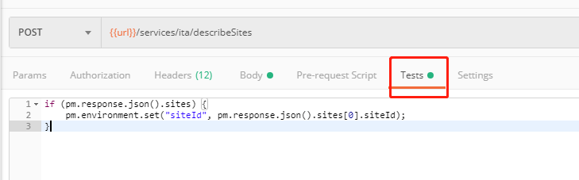
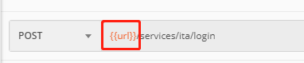
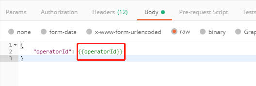

[TOC]

Postman脚本在界面的**Tests**标签中。



## 基础使用方式

- url和请求body使用：

  

  

- postman tests scripts:

  ```js
  // 获取变量值
  pm.environment.get("variable_key");
  // 设置变量值
  pm.environment.set("variable_key", "variable_value");
  ```

## 从响应中获取值

postman tests scripts:

```js
// 响应头中获取
pm.response.headers.get('X-Auth-Token')
// cookies中获取
pm.cookies.get('JSESSIONID')
// body中获取，resultCode是其中一个key
pm.response.json().resultCode
```

**参考**：[post tests script doc](https://learning.getpostman.com/docs/postman/scripts/test-scripts/)