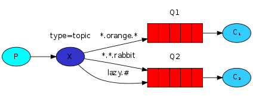

RabbitMQ是实现了高级消息队列协议（AMQP）的开源消息代理软件（亦称面向消息的中间件）。RabbitMQ服务器是用Erlang语言编写的，而集群和故障转移是构建在开放电信平台框架上的。所有主要的编程语言均有与代理接口通讯的客户端库

## 安装

环境：centos7.5

### 安装erlang

Erlang下载地址：https://www.rabbitmq.com/releases/erlang/。Erlang环境一定要与RabbitMQ版本匹配：https://www.rabbitmq.com/which-erlang.html

> 本文使用18版本：https://www.rabbitmq.com/releases/erlang/erlang-18.3.4.4-1.el7.centos.x86_64.rpm

安装：`rpm -ivh erlang-18.3.4.4-1.el7.centos.x86_64.rpm`

### 安装socat

下载地址：http://mirror.centos.org/centos/7/os/x86_64/Packages/socat-1.7.3.2-2.el7.x86_64.rpm

安装：`rpm -ivh socat-1.7.3.2-2.el7.x86_64.rpm`

### 安装rabbitmq-server

RabbitMQ下载地址：https://www.rabbitmq.com/releases/rabbitmq-server/

> 本文使用：https://www.rabbitmq.com/releases/rabbitmq-server/v3.6.15/rabbitmq-server-3.6.15-1.el7.noarch.rpm

安装：`rpm -ivh rabbitmq-server-3.6.15-1.el7.noarch.rpm`

### 配置rabbitmq

修改文件vim /usr/lib/rabbitmq/lib/rabbitmq_server-3.6.5/ebin/rabbit.app，删除**loopback_users**将里面的**<<"guest">>**。

删除后的内容为：**{loopback_users, []}**。

### 安装管理插件

运行`rabbitmq-plugins enable rabbitmq_management`

### 访问地址

url：http://localhost:15672，用户：guest/guest

### 启动服务

```bash
systemctl start rabbitmq-server.service
```

如果有权限问题，运行命令：

```base
chown -R rabbitmq:rabbitmq /var/lib/rabbitmq/mnesia/
chown -R rabbitmq:rabbitmq /var/log/rabbitmq
```

## 定义

### Channel

Channel是我们与RabbitMQ打交道的最重要的一个接口，我们大部分的业务操作是在Channel这个接口中完成的，包括定义Queue、定义Exchange、绑定Queue与Exchange、发布消息等。

### Queue

Queue（队列）是RabbitMQ的内部对象，用于存储消息。

### Exchange

生产者将消息发送到Exchange（交换器，下图中的X），由Exchange将消息路由到一个或多个Queue中（或者丢弃）

### Routing key

生产者在将消息发送给Exchange的时候，一般会**指定一个routing key**，来指定这个消息的路由规则，而这个routing key需要与Exchange Type及binding key联合使用才能最终生效。

**在Exchange Type与binding key固定的情况下（在正常使用时一般这些内容都是固定配置好的）**，我们的生产者就可以在发送消息给Exchange时，通过指定routing key来决定消息流向哪里。RabbitMQ为routing key设定的长度限制为255 bytes。

### Binding

RabbitMQ中通过Binding将Exchange与Queue关联起来

### Binding key

在绑定（Binding）Exchange与Queue的同时，一般会指定一个binding key；消费者将消息发送给Exchange时，一般会指定一个routing key；**当binding key与routing key相匹配时**，消息将会被路由到对应的Queue中。

## Exchange Types

### fanout

把所有发送到该Exchange的消息路由到所有与它绑定的Queue中。


### direct

把消息路由到那些routing key与binding key完全匹配的Queue中。


以上图的配置为例：

1. 我们**以routingKey=”error”发送消息**到Exchange，则消息会路由到Queue1（amqp.gen-S9b…，这是由RabbitMQ自动生成的Queue名称）和Queue2（amqp.gen-Agl…）；
2. 如果我们**以routingKey=”info”或routingKey=”warning”来发送消息**，则消息只会路由到Queue2；
3. 如果我们**以其他routingKey发送消息**，则消息不会路由到这两个Queue中。

### topic

把将消息路由到routing key与binding key**相匹配**的Queue中。



匹配规则：

1. routing key为一个句点号“. ”分隔的字符串（我们将被句点号“. ”分隔开的每一段独立的字符串称为一个单词），如“stock.usd.nyse”、“nyse.vmw”、“quick.orange.rabbit”；
2. binding key与routing key一样也是句点号“. ”分隔的字符串；
3. binding key中可以存在两种特殊字符“\*”与“#”，用于做模糊匹配，其中“\*”用于匹配一个单词，“#”用于匹配多个单词（可以是零个）

以上图中的配置为例：

1. routingKey=”quick.orange.rabbit”的消息会同时路由到Q1与Q2
2. routingKey=”lazy.orange.fox”的消息会路由到Q1与Q2；
3. routingKey=”lazy.brown.fox”的消息会路由到Q2；
4. routingKey=”lazy.pink.rabbit”的消息会路由到Q2（只会投递给Q2一次，虽然这个routingKey与Q2的两个bindingKey都匹配）；
5. routingKey=”quick.brown.fox”、routingKey=”orange”、routingKey=”quick.orange.male.rabbit”的消息将会被丢弃，因为它们没有匹配任何bindingKey。

## 参考

1. [RabbitMq入门以及使用教程](https://www.cnblogs.com/yhll/articles/9729355.html)