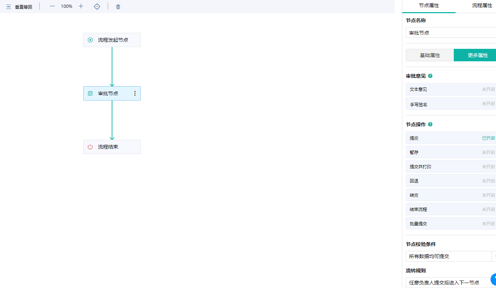

# 构建工作流低代码平台

## 工作流低代码平台

工作流是指一类能够完全自动执行的经营过程，根据一系列过程规则，将文档、信息或任务在不同的执行者之间进行传递与执行。

在目前这个“互联网+”和“数字化转型”的时代，企业越来越需要通过应用（App）来改善企业内部的信息流转。然而，诞生还不太久的IT信息时代，也正面临着与我国社会主义初级阶段类似的供需关系矛盾：落后的软件开发生产力跟不上人民日益增长的业务需求。

**低代码平台**的发展推动了人效革命的步伐：

- 低代码开发平台（LCDP）本身也是一种软件，它为开发者提供了一个创建应用软件的开发环境。
- 与传统代码IDE不同的是，低代码开发平台提供的是更高维和易用的可视化IDE。大多数情况下，开发者并不需要使用传统的手写代码方式进行编程，而是可以通过图形化拖拽、参数配置等更高效的方式完成开发工作。

低代码平台其中一个特性和关键能力就是：**BPM(业务流程管理)即工作流**。BPM注重流程化开发，目的是通过系统性的改善企业内部的流程来提升组织效率。

那么构建工作流低代码平台能给企业以及开发人员带来哪些优点呢？

## 优点

###  提效降本

虽然软件行业一直在高速发展，但作为从业者我们不得不承认：软件开发仍处于手工作坊阶段，效率低、人力成本高、质量不可控。项目延期交付已成为行业常态，而瓶颈几乎总是开发人员（对机器能解决的问题都不是问题）；优秀的开发人才永远是稀缺资源，还贼贵；软件质量缺陷始终无法收敛，线上故障频发资损不断。

相比而言，传统制造业经过几百年工业革命的发展，大部分早已摆脱了对“人”的强依赖：从原料输入到制品输出，中间是各种精密仪器和自动化流水线的稳定支撑，真正实现生产的标准化和规模化。虽然信息化号称是人类的第三次工业革命，但以软件行业目前的状况，远远还没到达成熟的“工业化”阶段。

**工作流低代码平台将应用软件开发过程工业化：应用工厂中各种成熟的基础设施、现成的标准零件、自动化的装配流水线，开发者只需要专注于最核心的业务价值即可。即便是碰到非标需求，也可以随时自己动手，用最灵活的手工定制（代码）方式来解决各种边角问题。**

### 扩大应用开发劳动力

通过让大部分开发工作可以仅通过简单的拖拽与配置完成，工作流低代码平台显著降低了使用者门槛，让企业能够充分利用不懂代码的业务人员资源。部分需求场景下，还能让业务人员实现自助式（self-service）应用交付，既解决了传统IT交付模式下的任务堆积问题，避免稀缺的专业开发资源被大量简单、重复性的应用开发需求所侵占，也能让业务人员真正按自己的想法去实现应用，摆脱交由他人开发时不可避免的桎梏。

基于这些优点，显而易见强大的工作流平台带来的价值是十分巨大。因此平台所具有的功能与灵活性是十分重要的。

## 具备能力

###  表单设计能力

不同的业务，例如企业中请假、报销等各种各样的申请流程，必然会有不同的业务数据，为满足丰富的业务需求，平台需要提供丰富和灵活的表单组件。

- 丰富的表单组件，满足常见的数据填写
- 使用简单，通过拖拽等操作就可以完成表单设计
- 支持多平台，在常见的pc、手机端均可使用
- 支持EXCEL导入导出
- 业务数据可查询、可分析

### 流程设计能力

老式的流程引擎设计脱离不开开发人员的参与。流程节点、流转、人员配置等常常需要开发人员、业务人员之间不断确认沟通，容易产生信息不对称导致配置问题。所以界面化、简单化的流程设计是工作流平台不可或缺的一部分。

- 可视化界面、通过拖拽、连线即可设计好流程
- 节点人员配置和企业用户体系直接交互，简单灵活配置办理人

### 规则策略能力

不同的业务显然会有一些特殊的要求，通过构建一些通用的策略、规则兼容解决一些特殊要求是十分有必要的。会极大的增加工作流平台的兼容性和拓展性，避免未考虑到一些特殊要求导致定制化的代码不断增加，最终让平台难以维护升级。

- 提醒策略：支持流程流转、发起、完成、定时等不同策略。使流程的流转更加智能、人性化。
- 发起策略：是否允许撤回、是否允许催办等

## 参考

1. [什么是低代码（Low-Code）？](https://mp.weixin.qq.com/s/tMC1Uas99F28_tU5lH0CNw)
2. [简道云](https://www.jiandaoyun.com/)