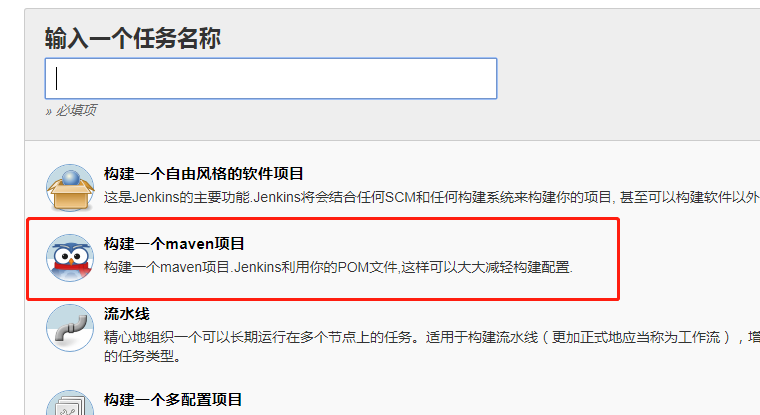
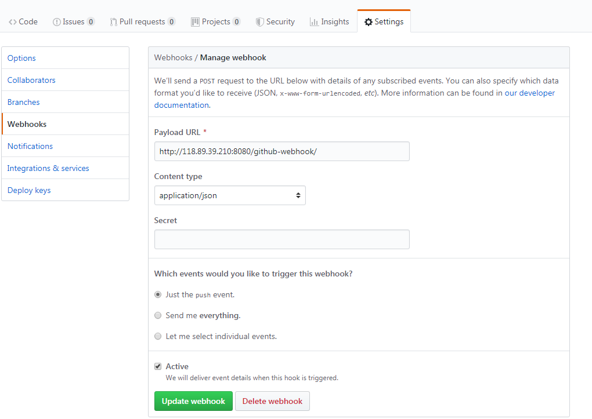

[TOC]

## github

### jenkins创建任务




### github钩子




## svn

### jar

```bash
node {
   stage('svn更新') { // for display purposes
    checkout([$class: 'SubversionSCM', additionalCredentials: [], excludedCommitMessages: '', excludedRegions: '', excludedRevprop: '', excludedUsers: '', filterChangelog: false, ignoreDirPropChanges: false, includedRegions: '', locations: [[cancelProcessOnExternalsFail: true, credentialsId: 'svn', depthOption: 'infinity', ignoreExternalsOption: true, local: '.', remote: 'https://192.168.92.71:8443/svn/cms/AppDev/IvyCloudPrint/trunk/CloudPrint/Server/cloud-print-manage@HEAD']], quietOperation: true, workspaceUpdater: [$class: 'UpdateUpdater']])
   }
   stage('mvn编译') {
    sh 'mvn clean package -U -DskipTests'
   }
   stage('存档') {
        archiveArtifacts 'target/*.jar,src/main/resources/application.properties'
   }
   stage('上传') {
     sh 'scp target/cloud-print-manage-1.0.0-SNAPSHOT.jar root@10.17.3.233:/root/tmp'
   }
   stage('部署更新') {
     sh 'ssh root@10.17.3.233 "/opt/cloud-print/manage/restart.sh"'
   }
}
```

### web

```bash
node {
   stage('svn更新') { // for display purposes
    checkout([$class: 'SubversionSCM', additionalCredentials: [], excludedCommitMessages: '', excludedRegions: '', excludedRevprop: '', excludedUsers: '', filterChangelog: false, ignoreDirPropChanges: false, includedRegions: '', locations: [[cancelProcessOnExternalsFail: true, credentialsId: 'svn', depthOption: 'infinity', ignoreExternalsOption: true, local: '.', remote: 'https://192.168.92.71:8443/svn/cms/AppDev/IvyCloudPrint/trunk/CloudPrint/Server/cloud-print-manage-web@HEAD']], quietOperation: true, workspaceUpdater: [$class: 'UpdateUpdater']])
   }
   stage('yarn安装') {
    sh 'yarn install'
   }
   stage('yarn编译') {
    sh 'yarn run build'
   }
   stage('打包') {
    sh 'tar -zcvf manage.tar.gz dist/*'
   }
   stage('存档') {
        archiveArtifacts 'manage.tar.gz'
   }
   stage('上传') {
     sh 'scp manage.tar.gz root@10.17.3.233:/root/tmp'
   }
   stage('部署更新') {
     sh 'ssh root@10.17.3.233 "rm -rf /usr/share/nginx/html/* && tar -zxvf /root/tmp/manage.tar.gz -C /usr/share/nginx/html  --strip-components 1"'
   }
}
```

